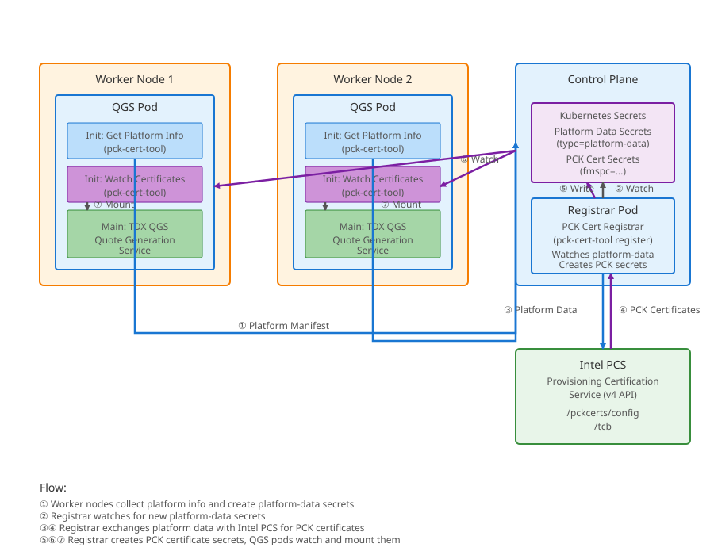

# Intel TDX DCAP Kubernetes Tools

Tools and Kubernetes operator for managing Intel Trust Domain Extensions (TDX) DCAP (Data Center Attestation Primitives) infrastructure in Kubernetes clusters.

## Overview

This repository provides automated certificate provisioning for Intel TDX quote generation in Kubernetes environments. It solves the challenge of distributing platform-specific PCK (Provisioning Certification Key) certificates required for remote attestation of TDX trust domains.

The system operates in three modes:

- **Online Mode**: Automatic certificate provisioning via Intel Provisioning Certification Service (PCS)
- **Offline Mode**: Manual certificate provisioning for air-gapped environments
- **External Mode**: PCK certificate secrets are managed by an external system; the operator only deploys and manages QGS

## Architecture



### How It Works

1. **Platform Registration**: QGS (Quote Generation Service) pods on worker nodes collect platform-specific information (CPU SVN, encrypted PPID, PCE ID, platform manifest) and store it in Kubernetes secrets labeled with `type=platform-data`.

2. **Certificate Provisioning** (Online Mode): The PCK Certificate Registrar watches for platform-data secrets and automatically exchanges them with Intel PCS API to retrieve platform-matched PCK certificates and TCB information.

3. **Certificate Distribution**: The registrar creates new secrets (labeled with `fmspc=<value>`) containing QCNL-compatible binary cache files. QGS pods watch for their corresponding PCK certificate secrets (name after unique platform IDs, such as QE ID) and mount them into the TDX Quote Generation Service container.

4. **Quote Generation**: With certificates available locally, the TDX QGS can generate attestation quotes without external network dependencies, enabling confidential computing workloads to prove their trustworthiness.

### Key Features

- **Platform-Specific Certificates**: Uses the `/pckcerts/config` Intel PCS API endpoint with actual platform raw CPU SVN values to retrieve certificates matched to each node's TCB (Trusted Computing Base) level
- **Automated Lifecycle**: Watches Kubernetes secrets for real-time certificate provisioning
- **DCAP-Compatible**: Generates binary cache files in Intel SGX DCAP QPL format
- **Flexible Deployment**: Supports online (PCS-connected), offline (air-gapped), and external (third-party managed) modes
- **Multi-Node**: Handles certificate provisioning for multiple worker nodes concurrently

## Components

### pck-cert-tool

A Rust command-line utility providing three main functions:

- **get-platforms**: Collects platform information from EFI variables and SGX platform info, creates Kubernetes secrets with platform data
- **register**: Watches platform-data secrets, exchanges them with Intel PCS for PCK certificates, creates certificate secrets
- **get-certificates**: Watches certificate secrets and writes them to the filesystem for consumption by QGS

See [bin/pck-cert-tool/README.md](bin/pck-cert-tool/README.md) for detailed documentation.

### intel-tdx-dcap-operator

A Kubernetes operator that manages the TDX Quote Generation Service lifecycle through the `TdxQuoteGenerationService` Custom Resource Definition (CRD).

Features:
- Deploys QGS DaemonSets on SGX-capable nodes
- Configures platform registration mode (Online/Offline)
- Manages certificate watcher init containers
- Configures QCNL (Quote Config and Network Library) for local cache operation

See [bin/operator/README.md](bin/operator/README.md) for operator documentation.

## Quick Start

### Prerequisites

- Kubernetes cluster with SGX/TDX-capable worker nodes and appropriate Pod Security Standards and Resource Quotas configured to prevent unwanted QGS hostPath volume access and/or `sgx.intel.com/*` resource use.
- [Intel PCS API key](https://api.portal.trustedservices.intel.com/) (for Online mode only)
- Nodes labeled with `intel.feature.node.kubernetes.io/sgx=true`

### Deployment

1. **Build the container images** (see [DOCKER.md](DOCKER.md) for details)**:**

   ```bash
   docker build -t intel-tdx-qgs:latest -f build/tdx-qgs/Dockerfile .
   docker build -t intel-tdx-dcap-operator:latest -f build/operator/Dockerfile .
   ```

2. **Deploy the operator:**

   ```bash
   kubectl apply -k bin/operator/deployment/default
   ```

3. **Create [Intel PCS API key](https://api.portal.trustedservices.intel.com/) secret (Online mode only):**

   The secret must be created in the operator's namespace:
   ```bash
   kubectl create secret generic intel-pcs-api-key \
     --from-literal=api-key=YOUR_INTEL_API_KEY \
     --namespace intel-dcap-operator-system
   ```

4. **Create a TdxQuoteGenerationService resource:**

   **Online Mode:**
   ```yaml
   apiVersion: trustedservices.intel.com/v1
   kind: TdxQuoteGenerationService
   metadata:
     name: intel-tdx-dcap
   spec:
     platformRegistration:
       Online:
         apiKeySecretName: intel-pcs-api-key
     nodeSelector:
       - "intel.feature.node.kubernetes.io/sgx=true"
   ```

   **Offline Mode:**
   ```yaml
   apiVersion: trustedservices.intel.com/v1
   kind: TdxQuoteGenerationService
   metadata:
     name: intel-tdx-dcap
   spec:
     platformRegistration:
       Offline: {}
     nodeSelector:
       - "intel.feature.node.kubernetes.io/sgx=true"
   ```

   **External Mode** (PCK certificate secrets provisioned by an external system):
   ```yaml
   apiVersion: trustedservices.intel.com/v1
   kind: TdxQuoteGenerationService
   metadata:
     name: intel-tdx-dcap
   spec:
     platformRegistration:
       External: {}
     nodeSelector:
       - "intel.feature.node.kubernetes.io/sgx=true"
   ```

5. **Apply the resource:**

   ```bash
   kubectl apply -f tdx-qgs.yaml
   ```

### Verification

Check running pods:

```bash
kubectl get pods -n intel-dcap-operator-system -l 'app in (intel-tdx-qgs,intel-tdx-registrar)'
```

View platform data secrets:

```bash
kubectl get secrets -n intel-dcap-operator-system -l type=platform-data
```

View PCK certificate secrets:

```bash
kubectl get secrets -n intel-dcap-operator-system -l fmspc --show-labels
```

Verify certificates in QGS pod:

```bash
POD_NAME=$(kubectl get pod -n intel-dcap-operator-system -l app=intel-tdx-qgs -o name | head -1)
kubectl exec -n intel-dcap-operator-system -it $POD_NAME -- ls -la /run/dcap/cache/.dcap-qcnl/
```

## Documentation

- [pck-cert-tool README](bin/pck-cert-tool/README.md) - Detailed CLI tool documentation
- [Operator README](bin/operator/README.md) - Kubernetes operator documentation
- [Docker README](DOCKER.md) - Container build and deployment guide

## Technical Details

### Certificate Cache File Format

The tool generates binary cache files compatible with Intel SGX DCAP QPL:

1. **Cache Header** (14 bytes): Version, flags, expiration timestamp
2. **TCB Component**: Platform-specific CPU SVN (16 bytes as hex string)
3. **SGX TCB Info**: JSON from Intel PCS `/tcb` endpoint
4. **Certificate Chain**: PEM-encoded certificate chain
5. **PCK Certificates**: JSON array of certificates matched to platform's TCB level

### Intel PCS API Integration

The registrar uses Intel PCS v4 API endpoints:

- `/sgx/certification/v4/pckcerts/config` - Retrieves platform-matched PCK certificates using CPU SVN
- `/sgx/certification/v4/tcb?fmspc=<value>&update=early` - Retrieves TCB information

## License

[License information]

## Contributing

[Contributing guidelines]
